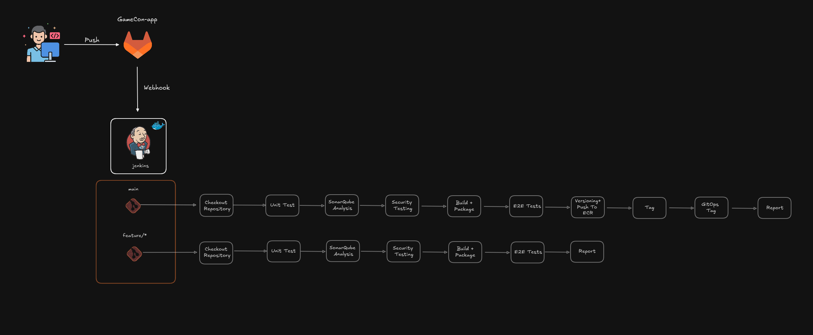
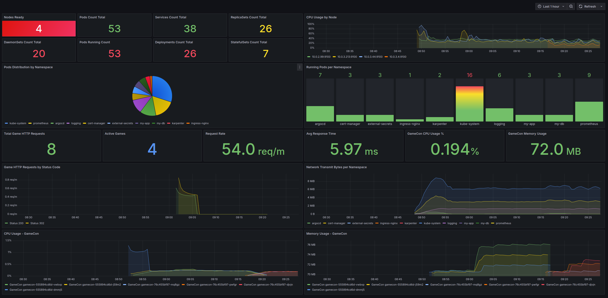

# GameCon App

> A Flask-based game management application demonstrating modern DevOps practices including containerization, CI/CD pipelines, monitoring, and GitOps deployment workflows.

## Table of Contents

- [Overview](#overview)
- [Architecture](#architecture-diagrms)
- [Technology Stack](#technology-stack)
- [Repository Structure](#repository-structure)
- [Getting Started](#getting-started)
- [Contact](#contact)

## Overview

GameCon App is a comprehensive web application for managing game collections that showcases enterprise-grade DevOps practices. The project demonstrates full-stack development with automated testing, security scanning, quality analysis, and cloud deployment using modern containerization and GitOps principles.

Key features:

- **Full CRUD Operations** - Create, read, update, and delete game entries with cover images
- **Enterprise Monitoring** - Prometheus metrics, structured logging, and health checks
- **Security-First Approach** - Bandit security scanning.
- **Cloud-Native Deployment** - Docker containerization with AWS ECR.
- **Automated Quality Assurance** - Unit testing, coverage analysis, and SonarQube integration

## architecture diagrms

### CI/CD Architecture


This diagram illustrates the overview of the project.



This diagram illustrates the continuous integration and deployment pipeline, showcasing:

- Code commit and review process
- Automated testing and quality checks
- Container image building and registry
- Deployment workflow with ArgoCD

### Kubernetes Architecture


This diagram shows the Kubernetes-based infrastructure, including:

- EKS cluster configuration
- Service mesh and networking
- Storage and persistence
- Monitoring and logging components
- ArgoCD
- Karpentar

### Cloud Architecture


This diagram demonstrates the AWS cloud infrastructure, featuring:

- VPC and networking layout
- EKS cluster setup
- Load balancing and security
- Managed services integration
- Secret Manager
- CloudFront for static files

### Monitoring Architecture



This diagram illustrates the monitoring infrastructure, featuring:

- Prometheus metrics collection
- Grafana dashboards
- Service and infrastructure monitoring
- Performance metrics visualization

## Repository Structure

```
GameCon/
├── gamecon-app-main/            # Public App repository
├── gamecon-infra-main/          # Public infrastructure repository
└── gamecon-gitops-main/         # Public GitOps repository
```

## Technology Stack

| Category           | Technologies                                                     |
| ------------------ | ---------------------------------------------------------------- |
| **Frontend**       | HTML, JavaScript, CSS                                            |
| **Backend**        | Python, Flask, PostgreSQL                                        |
| **Infrastructure** | AWS, Terraform, Kubernetes (EKS)                                 |
| **CI/CD**          | Jenkins, ArgoCD, Docker                                          |
| **Monitoring**     | Prometheus, Grafana                                              |
| **Logging**        | EFK Stack (Elasticsearch, Fluent Bit, Kibana)                    |
| **Security**       | AWS IAM, RBAC, Security Groups, Secret Manager, External Secrets |

## Components

### App

- Flask-based REST API
- PostgreSQL for data persistence
- Prometheus metrics export
- Logging metrics export

### Infrastructure

- Complete AWS infrastructure with Terraform
- EKS cluster provisioning
- Networking and security setup
- Managed services configuration

### GitOps

- ArgoCD-based deployment
- Helm charts for application deployment
- Infrastructure applications management
- Kubernetes add-ons configuration

## Getting Started

1. **Clone the Repository**

```bash
git clone --recursive https://github.com/AndiShobash/GameCon
```

2. **Infrastructure Setup**

```bash
cd gamecon-infra-main
terraform init
terraform apply

ArgoCD will be up with the infrastructure and start the gitops automatically
```

## Contact

Andi Shobash

- Email: andishubash@gmail.com
- LinkedIn: https://www.linkedin.com/in/andi-shobash/
- GitLab: https://gitlab.com/andishubash/
