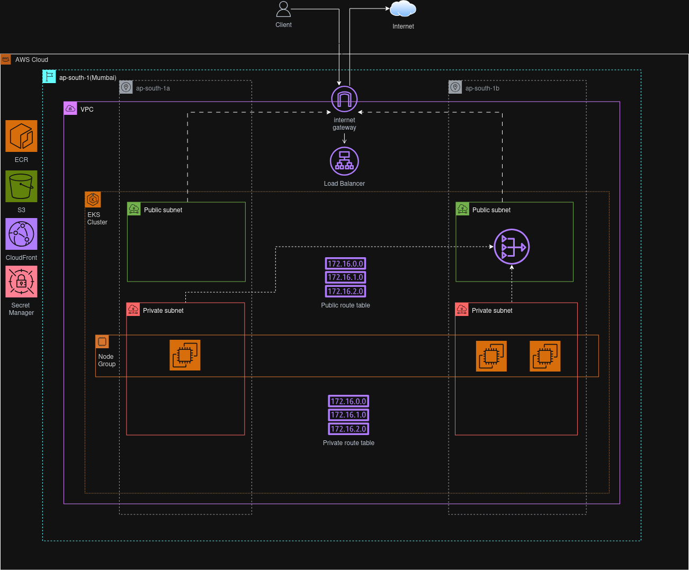

# EKS Infrastructure with ArgoCD

> Enterprise-grade Kubernetes infrastructure on AWS EKS with GitOps deployment using ArgoCD, demonstrating Infrastructure as Code, container orchestration, and automated deployment practices.

## Table of Contents

- [Overview](#overview)
- [Architecture](#architecture)
- [Technology Stack](#technology-stack)
- [Repository Structure](#repository-structure)
- [Prerequisites](#prerequisites)
- [Getting Started](#getting-started)
- [Acknowledgments](#acknowledgments)

## Overview

This project demonstrates production-ready Kubernetes infrastructure on AWS EKS with comprehensive GitOps workflows. The infrastructure includes networking, security, monitoring, and automated application deployment using ArgoCD. It showcases modern DevOps practices including Infrastructure as Code, container orchestration, and continuous deployment.

Key features:

- **Production-Ready EKS Cluster** - Multi-AZ deployment with managed node groups and Karpenter autoscaling
- **GitOps Deployment** - ArgoCD for automated application deployment and infrastructure management
- **Comprehensive Security** - IAM roles, RBAC, service accounts, and secrets management integration
- **Auto-Scaling Infrastructure** - Karpenter for intelligent node provisioning and cost optimization
- **Monitoring & Observability** - EKS addons, metrics collection, and centralized logging capabilities

## Architecture



## Technology Stack

| Category             | Technologies   |
| -------------------- | -------------- |
| **Infrastructure**   | Terraform, AWS EKS, VPC, IAM, S3 Backend |
| **Containerization** | Kubernetes 1.32, Docker, Helm Charts |
| **CI/CD**            | ArgoCD, GitOps, Automated Sync Policies |
| **Version Control**  | GitLab, SSH Key Authentication |
| **Security**         | AWS IAM Roles, IRSA, External Secrets Operator |
| **Networking**       | VPC, NAT Gateway, Internet Gateway, Security Groups |
| **Autoscaling**      | Karpenter, Cluster Autoscaler, HPA |
| **Storage**          | EBS CSI Driver, GP3 Storage Classes |
| **Monitoring**       | CoreDNS, VPC-CNI, Kube-proxy, Prometheus Ready |
| **Secrets**          | AWS Secrets Manager, External Secrets Integration |

## Repository Structure
 
```
eks-infrastructure/
├── modules/                    # Terraform modules for reusable components
│   ├── network/               # VPC, subnets, routing, and security groups
│   │   ├── main.tf           # VPC, subnets, NAT/IGW configuration
│   │   ├── variables.tf      # Network configuration variables
│   │   └── output.tf         # Network resource outputs
│   ├── eks/                  # EKS cluster configuration
│   │   ├── main.tf           # EKS cluster, OIDC, access policies
│   │   ├── variables.tf      # Cluster configuration variables
│   │   └── outputs.tf        # Cluster information outputs
│   ├── nodes/                # EKS managed node groups
│   │   ├── main.tf           # Node group, IAM roles, policies
│   │   ├── variables.tf      # Node configuration variables
│   │   └── outputs.tf        # Node group information
│   ├── addons/               # EKS addons and cluster components
│   │   ├── main.tf           # CSI drivers, Karpenter, External Secrets
│   │   ├── variables.tf      # Addon configuration variables
│   │   └── outputs.tf        # Addon status and ARNs
│   └── argocd/               # ArgoCD GitOps deployment
│       ├── main.tf           # ArgoCD Helm installation, SSH secrets
│       ├── variables.tf      # ArgoCD configuration variables
│       └── outputs.tf        # ArgoCD deployment status
├── argocd-files/             # ArgoCD configuration files
│   ├── argocd-values.yaml    # Helm values for ArgoCD installation
│   ├── argocd-app.yaml       # Bootstrap application configuration
│   └── gamecon-app.yaml      # GameCon application deployment
├── main.tf                   # Root module orchestration
├── variables.tf              # Root-level input variables
├── output.tf                 # Infrastructure outputs
├── providers.tf              # Provider configurations and state backend
├── tf.tfvars                 # Environment-specific values
└── README.md                 # This documentation
```

## Prerequisites

Requirements for deploying and managing the infrastructure:

- **AWS CLI** (version 2.0+) configured with appropriate permissions
- **Terraform** (version 1.5+) for infrastructure provisioning
- **kubectl** (version 1.28+) for Kubernetes cluster management
- **Helm** (version 3.0+) for application deployment
- **Git** access to GitLab repositories with SSH key authentication

## Getting Started

Follow these instructions to deploy the EKS infrastructure and configure GitOps workflows.

### Infrastructure Deployment

1. **Configure AWS Authentication**

```bash
# Configure AWS CLI with your credentials
aws configure
# Verify access to your AWS account
aws sts get-caller-identity
```

2. **Clone and Configure Repository**

```bash
# Clone the infrastructure repository
git clone https://github.com/your-username/eks-infrastructure.git
cd eks-infrastructure

# Copy and customize variables
cp tf.tfvars.example tf.tfvars
# Edit tf.tfvars with your specific configuration
```

Expected configuration in `tf.tfvars`:

```hcl
vpc_cidr                = "10.0.0.0/16"
subnet_newbits          = 8
availability_zone_count = 2
cluster_name            = "your-eks-cluster"
region                  = "ap-south-1"
admin_users             = ["arn:aws:iam::ACCOUNT:user/YourUser"]
desired_size           = 3
max_size               = 4
min_size               = 2
```

## Infrastructure Components

### Networking
- **VPC**: Multi-AZ virtual private cloud with public and private subnets
- **Internet Gateway**: Public internet access for public subnets
- **NAT Gateway**: Outbound internet access for private subnets
- **Route Tables**: Proper routing configuration for public/private traffic

### Security
- **IAM Roles**: Service-specific roles with least privilege access
- **IRSA**: IAM Roles for Service Accounts integration
- **Security Groups**: Network-level security controls
- **External Secrets**: AWS Secrets Manager integration for sensitive data

### Compute
- **EKS Cluster**: Managed Kubernetes control plane (version 1.32)
- **Managed Node Groups**: Auto-scaling worker nodes (t3a.medium instances)
- **Karpenter**: Intelligent node provisioning and cost optimization
- **Instance Profiles**: EC2 instance roles for node groups

### Storage
- **EBS CSI Driver**: Persistent volume support with GP3 storage
- **Storage Classes**: Optimized storage configurations for different workloads
- **Volume Expansion**: Support for dynamic volume resizing

### Add-ons
- **CoreDNS**: Cluster DNS resolution
- **VPC-CNI**: Advanced networking for pods
- **Kube-proxy**: Service discovery and load balancing
- **External Secrets Operator**: Secrets synchronization from AWS

## Cost Optimization

The infrastructure includes several cost optimization features:

- **Karpenter**: Intelligent instance selection and spot instance utilization
- **Single NAT Gateway**: Reduced networking costs with shared outbound connectivity
- **Right-sized Instances**: t3a.medium instances optimized for typical workloads
- **EBS GP3**: Cost-effective storage with baseline performance
- **Resource Tagging**: Comprehensive cost allocation and tracking

**Estimated Monthly Costs** (ap-south-1 region):
- EKS Control Plane: ~$73
- Managed Node Groups (3 x t3a.medium): ~$65
- NAT Gateway: ~$32
- EBS Storage (50GB): ~$5
- **Total**: ~$175/month

## Security Best Practices

- **Network Isolation**: Private subnets for worker nodes
- **IAM Least Privilege**: Minimal required permissions for each component
- **Secrets Management**: External secrets with rotation capabilities
- **Network Policies**: Pod-to-pod communication controls
- **Image Security**: Container image scanning and vulnerability management

## Acknowledgments

- **AWS EKS Team** for providing managed Kubernetes infrastructure
- **ArgoCD Community** for powerful GitOps deployment capabilities
- **Terraform** for enabling Infrastructure as Code best practices
- **Karpenter Project** for intelligent Kubernetes node provisioning
- **External Secrets Operator** for seamless secrets management integration
- **HashiCorp** for comprehensive cloud infrastructure tooling
- **Kubernetes Community** for container orchestration platform